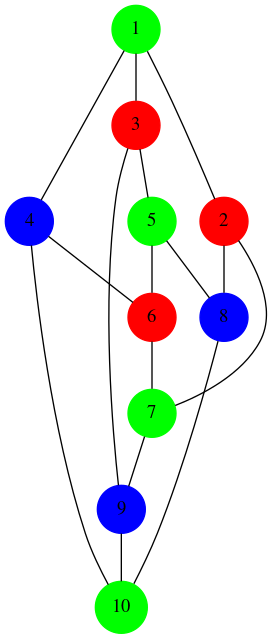

# Graph Coloring

This program takes in a graph as input, attempts to generate a graph colouring solution, and then exports it in Graphviz DOT format. The original [repo](https://github.com/dwave-examples/graph-coloring) I adapted my code from used hard-coded examples and lacked importing/exporting, so this project aims to add these features.

## Usage

To run the demo:

```bash
python qolourize.py graph_file output_name
```

Where `graph_file` is a graph file. Included examples you can use are `graph_1.txt`, `graph_2.txt`, and `graph_3.txt`. You must also have an API key to use DWave's computers!

In running Qolourize with `graph_3.txt` it will produce a solution which might look like this:

```
Solution: {1: 0, 2: 1, 3: 1, 4: 2, 7: 0, 8: 2, 5: 0, 9: 2, 6: 1, 10: 0}
Solution energy: 9.0
Solution validity: True
```

and then export files representing the visual output (.SVG, .PNG, and .GV). For example, the colouring solution to the Petersen graph mentioned above:



Here we see that no neighboring nodes have the same color. The validity check checks that that is the case.

The format for input graph files is just `node_number,node_number` on every line. For example, the [Petersen graph](https://en.wikipedia.org/wiki/Petersen_graph) (aka `graph_3.txt`) is represented as:
```
1,2
1,3
1,4
2,7
2,8
3,5
3,9
4,6
4,10
5,6
5,8
6,7
7,9
8,10
9,10

```

_(the rest of the README comes from the [original repo](https://github.com/dwave-examples/graph-coloring))_

## Code Overview
Leap's DQM solver accepts problems expressed in terms of a DiscreteQuadraticModel object. The DiscreteQuadraticModel contains two dictionaries:

* linear biases
* quadratic biases

We want to define these two dictionaries so that a low-energy solution found by the DQM solver will correspond to a solution of the graph coloring problem.

For this problem, it is easiest to think in terms of ordered pairs (node, color). We will choose colors numbered from 0 to 3, since four colors will color any map in a plane. The nodes will be numbered starting from 0 in the code. For example, the pair (1, 2) corresponds to node 1 and color 2.

### Linear Biases

We set the linear biases in order to use as few colors as possible. We assume 
a very simple relationship: color k will be penalized by an bias k. This will 
encourage the system to use the lowest numbered colors as much as possible, 
which will discourage some colors from being used. 
Here's the table that we use, for this problem:

|Node|Color|Linear Bias|
|----|-----|-----------|
|0|0|0|
|0|1|1|
|0|2|2|
|0|3|3|
|1|0|0|
|1|1|1|
|1|2|2|
...

For 7 nodes, we see that the table in this problem will have 28 rows.

### Quadratic

The quadratic dictionary tells the DQM solver how to penalize variable combinations, between different ordered pairs, that we want to avoid. In this problem, this means implementing the constraint that neighboring nodes, on the graph, should not have the same color.

An example is that since nodes 0 and 1 have an edge, we do not want both node 0 and node 1 to have color 0. We also do not want them both to have color 1, or color 2. We see that there are four combinations that we will need to penalize for nodes 0 and 1. Looking at the graph, we see we will need to do the same thing for nodes 0 and 6; and for 1 and 2; and so on.

To do this, we apply a penalty to all of these combinations, and the penalty's strength is the Lagrange parameter. (https://en.wikipedia.org/wiki/Lagrange_multiplier)
If the DQM solver does not yield good solutions, we may need to increase the Lagrange parameter.

The quadratic dictionary will have entries of the form ```(Node1, Color1, Node2, Color2, Penalty)```, and all will be zero except when ```Color1 = Color2```.
With a Lagrange penalty of 3, the nonzero entries in the quadratic dictionary are:

|Node1|Color1|Node2|Color2|Penalty|
|-----|------|-----|------|-------|
|0|0|1|0|3|
|0|1|1|1|3|
|0|2|1|2|3|
|0|3|1|3|3|
|0|0|6|0|3|
|0|1|6|1|3|
|0|2|6|2|3|
|0|3|6|3|3|
...

You can see that there will be 16 rows, most of them zero, for each edge in 
the problem graph.

## Code Specifics

Let's go through the sections of code in the graph coloring problem:

* Initialize the DQM object
* Define the graph
* Define the linear bias dictionary. The gradient method is used to implement the condition described above, of penalizing color k by bias k
* Define the quadratic dictionary. For each (node1, node2) edge in the graph, define the 16 color combinations, and penalize only the cases which have the same color
* Solve the problem using the DQM solver
* Check that the solution is valid - nodes connected by edges should have different colors

## License

Released under the Apache License 2.0. See [LICENSE](LICENSE) file.
